> ### ECHO_LabDaemon
>
> **Created and designed by Digital Orukami** for **[ECHO Club](https://echoclub.org)**, inspired by
> [Clawdmeter](https://github.com/HermannBjorgvin/Clawdmeter). It runs on
> the **Waveshare ESP32-S3-Touch-LCD-4** (4 inch, 480×480, RGB parallel,
> GT911 touch, CH32V003 or TCA9554 expander detected at boot). Landing page:
> **[chalulabottle.github.io/ECHO_LabDaemon](https://chalulabottle.github.io/ECHO_LabDaemon/)**.
> Port plan and state: [`plans/waveshare-lcd-4-port.md`](plans/waveshare-lcd-4-port.md).
>
> ```
> pio run -d firmware -e waveshare_lcd_4 -t upload --upload-port COM11
> ```
>
> If `pio run` fails within seconds with "Failed to install Python dependencies", set `$env:PLATFORMIO_OFFLINE = "1"` in the same PowerShell before running pio.
>
> Wi-Fi and album art (`FEATURE_PICTURE=1`, with JPEGDEC) are built into the `waveshare_lcd_4` env only; every other env builds without Wi-Fi, HTTP or JPEG, and the stock 2.16 board sits at 99.0 % of its flash.
>
> The big tier works the same way: an animation marked `tier: 'big'` in `docs/bench/anims.js` exports to JSON and GIFs like any other but compiles into the firmware table only with `-DSPLASH_BIG=1`, which the `waveshare_lcd_4` env sets, so the stock 2.16 board's table is unchanged (83 animations with it, 73 without); `benchOnly: true` still keeps an animation on the bench and in the GIFs, on no board.
>
> The board advertises as ECHO_LabDaemon; the Windows tray daemon links every bonded board named ECHO_LabDaemon, ECHO_MiniDaemon or Clawdmeter.
>
> **Creatures in the works** (drawn for the ECHO edition, benched at
> [docs/bench/animations.html](https://chalulabottle.github.io/ECHO_LabDaemon/bench/animations.html),
> exported with `node tools/bench_to_json.js` into `tools/echo_anims/`):
>
> | Stock Clawd · idle blink | Clawd · coffee (on device) | ECHO creature · idle (on device) |
> |---|---|---|
> | 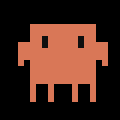 |  |  |
>
> ECHO skin over the stock movements (bench, heading for the firmware):
>
> | breathe | look around | wink | surprise |
> |---|---|---|---|
> | 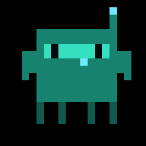 |  |  |  |
>
> | sleep | bounce | sway | think |
> |---|---|---|---|
> | 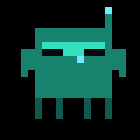 | 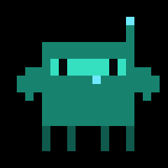 |  |  |
>
> | echo float | coffee morning | two agents | token burner | ultramode |
> |---|---|---|---|---|
> |  | 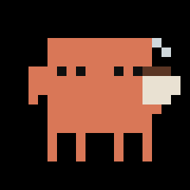 | 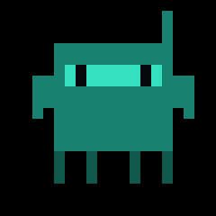 | 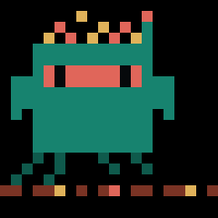 | 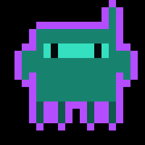 |
>
> | credits out | ctf hoodie | echo coffee | echo double coffee |
> |---|---|---|---|
> | 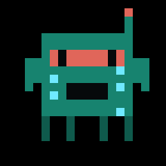 | 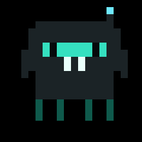 | 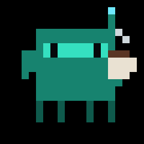 | 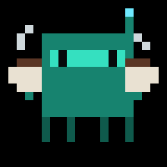 |
>
> Mornings are coffee: with the daemon's `clock=auto` option on, the device knows the local time and from 6 to 10 AM two picks in three come from the coffee creatures, two mugs on every third day.
>
> | echo walk | job done | echo love | echo consult | ultra cube |
> |---|---|---|---|---|
> | 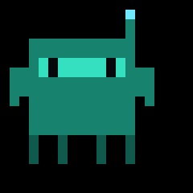 |  |  |  |  |
>
> | echo happy | echo ssh | echo loading | echo eye spin | echo kiss |
> |---|---|---|---|---|
> |  |  |  |  |  |
>
> | echo kiss b | echo summon | echo openclaw | echo headphones | headphones |
> |---|---|---|---|---|
> |  |  |  | 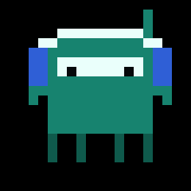 | 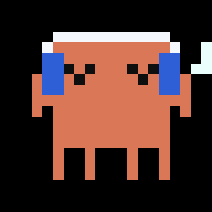 |
>
> | echo mushroom hd | echo breakdance hd | echo breakdance hd b | echo acrobat hd |
> |---|---|---|---|
> |  | 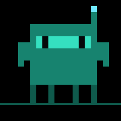 | 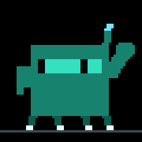 | 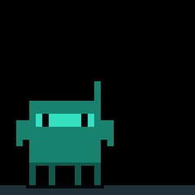 |
>
> | echo moonwalk hd | echo moonwalk hd b | echo rave bunny hd | echo rave bunny hd b |
> |---|---|---|---|
> | 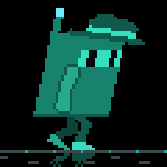 | 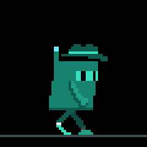 | 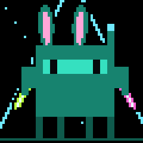 | 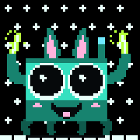 |
>
> The HD set is drawn on a 60 cell lattice of 8 px cells and lives in the big tier, on the 4 inch board only: mushroom hd with dilated black pupils and a sky, breakdance hd with a headspin on the antenna and its b take with a windmill, acrobat hd running a gymnast pass (cartwheel, back handspring, backflip, stuck landing), moonwalk hd with a lean and a fedora in a seamless 20 frame clip and its b take with a wrap, rave bunny hd with hands up through lasers, a build, a blackout and a drop with strobe and confetti, and its b take bouncing. Captures from the panel are in `docs/media/lcd4/`.
>
> **Model tiers**, one family, four signatures (Haiku, Sonnet, Opus, Fable):
>
> 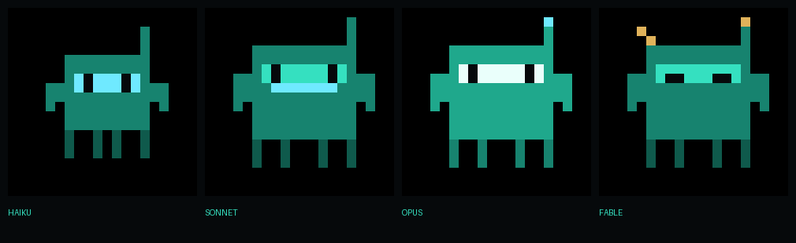
>
> Plus the thinking set (echo think spin, echo think deep, echo work, echo write, echo read) and the
> modes (opus enter, opus work, ultracode enter, ultracode work, agents split, agents join).
> 83 animations in the 4 inch board's firmware table as of 2026-10-01 (73 on boards built without the big tier); every one plays by name from the host (`a` field).
>
> Full progress board with states: [chalulabottle.github.io/ECHO_LabDaemon#creatures](https://chalulabottle.github.io/ECHO_LabDaemon/#creatures).
>
> The Clawdmeter itself — the device, the firmware, the board ports, the LVGL
> work, the BLE service, the animation engine — is
> **[Hermann Björgvin's](https://github.com/HermannBjorgvin/Clawdmeter)**
> project. This fork was cut from juppeee's `csb-buddy` branch (the box below
> is theirs); everything after both boxes is Hermann's README, unchanged.

> ### About the csb-buddy branch (juppeee)
>
> The Clawdmeter — the device, this firmware, the board ports, the LVGL work,
> the BLE service, the animation engine — is
> **[Hermann Björgvin's](https://github.com/HermannBjorgvin/Clawdmeter)**
> project. Everything below this box is his README, unchanged.
>
> This branch (`csb-buddy`) adds what the
> **[Claude Session Browser](https://github.com/juppeee/claude-session-browser)**
> needs on Windows, so the device shows *what Claude Code is doing* rather than
> only how fast the quota is burning:
>
> - **A field in the BLE payload** (`a`) so a host can name the animation to
>   play. Without a host naming one, nothing changes.
> - **Five more animations** — done, think, write, allow, limit — for states the
>   stock set doesn't cover. Reworked and partly redrawn from
>   [claudepix](https://claudepix.vercel.app).
> - **A fixed 90° rotation** on the C6-2.16, because I mount mine with the
>   buttons on top. Upstream has rotation disabled on this board; enabling it
>   revealed that bitmaps larger than the strip buffer were drawn unrotated, so
>   that path is rewritten to work in slices.
> - **A full splash rebuild after a screen switch**, needed because this build
>   flips to the usage screen on its own every few minutes. LVGL repaints in
>   strips, and the deferred rebuild left half a buddy behind.
>
> None of that is a fix to Hermann's project — every one of these exists
> because of a choice made here. That's why this is a fork and not a pull
> request.
>
> **You only need this build if you want the device to react to Clawd.** For
> the usage meter and battery, Hermann's firmware works with the Session
> Browser as it is — it simply ignores the extra field.
>
> The Session Browser is Windows-only, so that's the flashing command that
> matters here — from this branch, with your device's COM port:
>
> ```
> pio run -d firmware -e waveshare_amoled_216_c6 -t upload --upload-port COM5
> ```
>
> Everything else about flashing is unchanged from upstream.
>
> Anything broken here is my doing, not Hermann's — open an issue
> [on the fork](https://github.com/juppeee/Clawdmeter/issues), not on his
> tracker.

# Clawdmeter

A small ESP32 dashboard I made for my desk to keep an eye on Claude Code usage.

It runs on a [Waveshare ESP32-S3-Touch-AMOLED-2.16](https://www.waveshare.com/esp32-s3-touch-amoled-2.16.htm?&aff_id=149786) as well as a few other alternative boards and pairs over Bluetooth, the splash screen plays pixel-art Clawd animations that get
busier when your usage rate climbs. The two side buttons send Space and
Shift+Tab over BLE HID for Claude Code's voice mode and mode-toggle shortcuts.

|              Usage meter              |              Clawd animation screen              |
| :-----------------------------------: | :----------------------------------------------: |
|  |  |

The Clawd animations come from [claudepix](https://claudepix.vercel.app), [@amaanbuilds](https://x.com/amaanbuilds)'s library of pixel-art Clawd sprites, check it out, it's lovely.

## Screens

The device boots into the splash. Tap the screen anywhere to switch to the Usage view; tap again to flip back to the splash.

|              Splash               |              Usage              |
| :-------------------------------: | :-----------------------------: |
|  |  |
|   Splash; touch-toggle anytime    | Session and weekly utilization  |

While the splash is up, the middle (PWR) button cycles animations. **Hold the power button for 3 seconds, then release, to put the device into pairing mode** — this clears the saved Bluetooth bond and re-advertises. The firmware also auto-rotates animations every 20 s within the current usage-rate group, so a long stretch on the splash isn't just one Clawd on loop.

## Hardware

Boards supported out of the box:

- [Waveshare ESP32-S3-Touch-AMOLED-2.16](https://www.waveshare.com/esp32-s3-touch-amoled-2.16.htm?&aff_id=149786)
- [Waveshare ESP32-C6-Touch-AMOLED-2.16](https://www.waveshare.com/esp32-c6-touch-amoled-2.16.htm?&aff_id=149786) 
- [Waveshare ESP32-S3-Touch-AMOLED-1.8](https://www.waveshare.com/esp32-s3-touch-amoled-1.8.htm?&aff_id=149786)
- [Waveshare ESP32-C6-Touch-AMOLED-1.8](https://www.waveshare.com/esp32-c6-touch-amoled-1.8.htm?&aff_id=149786)
- [Waveshare ESP32-S3-Touch-AMOLED-2.06](https://www.waveshare.com/esp32-s3-touch-amoled-2.06.htm?&aff_id=149786)
- [Waveshare ESP32-S3-Touch-LCD-1.54](https://www.waveshare.com/esp32-s3-lcd-1.54.htm?sku=33869) (240x240 SPI TFT, not AMOLED)

> Please check if a pull request exists for your alternative hardware port before opening a new one, providing QA feedback and testing on the same hardware is more valuable than duplicate pull requests.

**Porting to another board:** the firmware is a thin HAL with per-board folders under `firmware/src/boards/`. Drop in a new folder and a new PlatformIO env — `main.cpp`, `ui.cpp`, and `splash.cpp` never need to change. See [`docs/porting/adding-a-board.md`](docs/porting/adding-a-board.md) for the walk-through and [`docs/porting/hal-contract.md`](docs/porting/hal-contract.md) for the interfaces a port must implement.

## Prerequisites

- Linux (tested on Ubuntu), macOS, or Windows 10/11
- [PlatformIO CLI](https://docs.platformio.org/en/latest/core/installation/index.html)
- Linux: `curl`, `bluetoothctl`, `busctl` (BlueZ Bluetooth stack)
- macOS: `python3` (the installer sets up a venv with `bleak` and `httpx`)
- Windows: `python3` 3.11+ (the installer sets up a venv with `bleak`, `httpx`, and `pystray`)
- Claude Code with an active subscription

## macOS installation

The macOS host pieces — Python daemon, LaunchAgent, and flash helper — were ported by [Chris Davidson (@lorddavidson)](https://github.com/lorddavidson). Thanks Chris!

### Flash the firmware

```bash
./flash-mac.sh waveshare_amoled_216                       # auto-detects /dev/cu.usbmodem*
./flash-mac.sh waveshare_amoled_18  /dev/cu.usbmodem1101  # or pass an explicit USB serial port
```

The board env name is required. Run `./flash-mac.sh` with no args to see the available envs (scraped from `firmware/platformio.ini`).

### Pair the device

After flashing, open **System Settings → Bluetooth** and click *Connect* next to "Clawdmeter". The daemon only ever connects to the peripheral this Mac is paired/connected to — it never scans for a nearby device — so once it's connected here the daemon picks it up on its next poll (~60 s).

### Install the daemon

The daemon reads your Claude OAuth token from the macOS Keychain (service `Claude Code-credentials`), polls usage every 60 s, and pushes it to the display over BLE.

```bash
./install-mac.sh
```

The installer creates a Python venv in `daemon/.venv/`, installs `bleak` and `httpx`, renders a LaunchAgent into `~/Library/LaunchAgents/com.user.claude-usage-daemon.plist`, and loads it. The first run is launched interactively so macOS prompts for Bluetooth permission.

Useful commands:

```bash
launchctl list | grep claude-usage                                          # check it's running
tail -F ~/Library/Logs/claude-usage-daemon.out.log                          # live logs
launchctl unload ~/Library/LaunchAgents/com.user.claude-usage-daemon.plist  # stop
launchctl load -w ~/Library/LaunchAgents/com.user.claude-usage-daemon.plist # start
```

## Linux installation

### Flash the firmware

```bash
./flash.sh waveshare_amoled_216                  # defaults to /dev/ttyACM0
./flash.sh waveshare_amoled_18  /dev/ttyACM1     # or pass an explicit USB serial port
```

The board env name is required. Run `./flash.sh` with no args to see the available envs (scraped from `firmware/platformio.ini`).

### Pair the device

After flashing, the device advertises as "Clawdmeter". Pair it once:

```bash
# Scan for the device
bluetoothctl scan le

# When "Clawdmeter" appears, pair and trust it
bluetoothctl pair F4:12:FA:C0:8F:E5    # use your device's MAC
bluetoothctl trust F4:12:FA:C0:8F:E5
```

To re-pair later, hold the power button for 3 seconds then release — the device clears its saved bond and re-advertises.

### Install the daemon

The daemon polls your Claude usage every 60 seconds and sends it to the display over BLE.

```bash
./install.sh
systemctl --user start claude-usage-daemon
```

Check status: `systemctl --user status claude-usage-daemon`

View logs: `journalctl --user -u claude-usage-daemon -f`

## Windows installation

Runs natively on Windows — no WSL required. A system-tray app polls your usage and pushes it over BLE, and starts automatically at login.

### Prerequisites

- **Native Windows** (not WSL).
- **Python 3.11+** from [python.org](https://www.python.org/downloads/) — check *"Add python.exe to PATH"* during install.
- **Claude Code** installed, with `claude login` completed. The token is read from `%USERPROFILE%\.claude\.credentials.json` (falling back to `%LOCALAPPDATA%\Claude\` then `%APPDATA%\Claude\`).
- The repo on a **native Windows path** (e.g. `%USERPROFILE%\Clawdmeter`), **not** a `\\wsl$` share — the installer refuses a WSL path.

### Flash the firmware

```powershell
pio run -d firmware -e waveshare_amoled_216 -t upload --upload-port COM5   # use your device's COM port
```

Run `pio run -d firmware` with no env to see the available board envs.

### Pair the device

The device is a bonded BLE HID keyboard, so pair it once: **Settings → Bluetooth & devices → Add device → Bluetooth**, then select "Clawdmeter". Pairing is **required** — it enables the physical buttons and keeps a persistent connection (the device keeps showing your last-synced usage even after the daemon quits). To undo, use **Remove device** (this disables the buttons).

### Install the daemon (recommended)

From the repo root in PowerShell:

```powershell
powershell -ExecutionPolicy Bypass -File install-windows.ps1
```

This creates a venv, installs `bleak`/`httpx`/`pystray`/`Pillow` from the in-repo requirements (no internet downloads), registers a per-user login-autostart entry (`HKCU\…\Run`, no admin needed), and launches the tray app headlessly (no console window).

### Run manually instead (optional)

```powershell
python -m venv .venv
.venv\Scripts\Activate.ps1        # if blocked: Set-ExecutionPolicy -Scope CurrentUser RemoteSigned, then retry
pip install -r daemon\requirements-windows.txt
python daemon\claude_usage_daemon_windows.py        # runs in the foreground; Ctrl+C to stop
```

### Tray icon and menu

The icon's corner bubble shows state — **green** Connected, **amber** Scanning, **red** Error — and hovering shows the status (`Connected · last update HH:MM`). A notification fires once when it enters Error (e.g. an expired token). Right-click for the menu:

- **Status header** — live state + last sync time.
- **Start at login** — toggle autostart on/off.
- **Quit** — stops the daemon cleanly; leaves the Windows pairing intact (device keeps its last reading).

### Approve Claude Code permission prompts from the device (ECHO edition)

When Claude Code is about to ask for permission, the device can show the prompt and the button (or a tap, on boards with touch) answers it. The device can only say **yes**; a **no** is given in the terminal, and doing nothing hands the prompt back to the terminal after 40 s. If the daemon is not running or the device is not connected, the hook returns in milliseconds and the terminal prompt shows as usual.

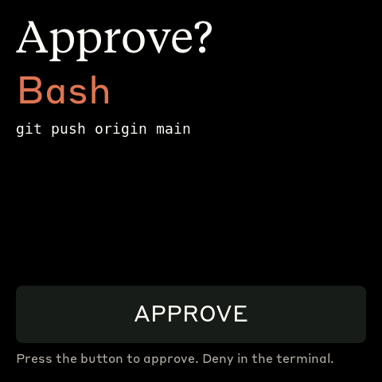

How it moves: Claude Code runs `daemon/clawdmeter_approve.py` as a `PermissionRequest` hook → the script writes `%LOCALAPPDATA%\Clawdmeter\approve.json` → the daemon pushes `{"q": id, "qt": tool, "qs": text, "qx": seconds}` to the device as its own BLE message (no API call in the way) → the panel shows the tool name in large type and the command/path underneath → the press sends `{"approve": id}` back on the TX characteristic → the daemon writes `decisions/<id>.json` → the hook prints the allow decision. A press inside the first 0.7 s after the prompt appears does nothing, so a press meant for the usage toggle can't approve something.

Add the hook yourself (nothing in the repo writes to your settings); `settings.json` or `~/.claude/settings.json`:

```json
{
  "hooks": {
    "PermissionRequest": [
      { "matcher": "", "hooks": [
        { "type": "command",
          "command": "C:\\path\\to\\Clawdmeter\\.venv\\Scripts\\python.exe C:\\path\\to\\Clawdmeter\\daemon\\clawdmeter_approve.py",
          "timeout": 60 }
      ] }
    ]
  }
}
```

The script always answers inside 40 s, under that timeout, so the hook's timeout path (which discards the output) never runs. Try it without Claude Code: `python daemon\clawdmeter_approve.py --test Bash "git push origin main"` puts a sample prompt on the device and prints what the hook would return; `ask` / `ok` / `askclr` over the serial console exercise the overlay with no host at all. The daemon must have been started from this code (restart the tray after updating).

The same serial console pokes the two host cards with no host: `msg <text>` shows a notification with a body only, `msg <title>|<text>` one with a title, and `msgclr` clears it. `page <title>|<l1>|<l2>|<l3>|<pp>|<anim>|<pi>` shows the generic card page: a title, three lines, progress 0..100 (empty for no bar), an optional creature name such as `echo headphones` (or `dance` for the dancing daemon) and an optional album art id; trailing fields may be left off, and `pageclr` takes it down. While the dance floor is up, `dance next` moves on to the next dancer through the shrink to the dot and `dance status` prints the pool, the dancer and the seconds until the next change. `btn pwr`, `btn pwr2`, `btn aux` and `btn aux2` press a button from the bench, once or twice in quick succession, down the same path as a real press. On the 4 inch board, the one built with Wi-Fi, `wifi <ssid>|<password>` stores a network and joins it (the bar is required and an open network is `wifi <ssid>|`; a line without the bar stores nothing and is never echoed), `wifi off` forgets it and `wifi status` reports the link without ever printing the password; `art <base url>` stores the base the album art comes from and `art status` reports on it.

### Notifications, pages and button reports (ECHO edition)

Two more host messages ride the same RX characteristic as approve: a notification `{"nt": title, "nb": body, "nx": seconds}` and a page `{"pg": name, "pt": title, "p1", "p2", "p3": lines, "pp": progress, "pa": creature, "pi": art}`; an empty `nt` and `nb`, or an empty `pg`, clears them. The board reports presses on TX as `{"btn": "pwr"|"pwr2"|"aux"|"aux2", "scr": "splash"|"usage"|"approve"|"notify"|"page"}`, with `scr` read before the press acts; `pwr2` and `aux2` only ever come from the page. A page from the host lapses after 90 s of host silence, so a tray that quit never leaves one stuck.

The buttons (BOOT is the aux key on the 4 inch board):

| Press | On the page | Anywhere else |
|---|---|---|
| PWR tap | back to the creature, nothing sent | sends `pwr`, then approves a prompt, else clears a notification, else steps the screens: creature, usage, the live page when there is one, creature |
| PWR double tap (two within 400 ms) | sends `pwr2`, previous track | two single taps |
| BOOT tap | sends `aux`, play or pause | sends `aux`, then approves a prompt, else clears a notification, else the next creature on the splash and brightness on usage |
| BOOT double tap | sends `aux2`, next track | two single taps |
| Touch tap | back to the creature | unchanged |

On the page a single tap waits the 400 ms out in case a second one follows, so it lands slightly late there and nowhere else. A page left this way stays live out of sight: its updates (title, lines, progress, creature, art) never bring it back, and it returns on the next PWR cycle or when a page with a different `pg` arrives.

Dance floor: `pa` set to `dance` is the dancing daemon. The board alternates two pools on the card, a feature for 90 s (echo breakdance hd, echo acrobat hd, echo rave bunny hd, echo dj, echo rave, echo mixer) and then a clip of a repeating move for 30 s (echo moonwalk hd, echo hop, echo swing, echo headphones, echo notes, echo cartwheel). Each pick is random within its pool and never the same one twice in a row, and a name missing from the board's table is skipped, so the same pools serve every board. Between two dancers a 1.2 s transition shrinks the creature to a dot and brings it back up as the next one. The clock runs only while the page is on top; a track change keeps the sequence and a page clear resets it. The serial log reads `page: dance feature <name>` and `page: dance clip <name>`. Any other name in `pa` is that creature, fixed.

Album art, on the 4 inch board only: `pi` names a picture, 8 to 16 characters of a to z and 0 to 9 (the engine sends 12). The board requests it over its own BLE characteristic (the one ending `0005`), a 2 byte indexed chunk stream behind an ab, al, an header, staged in PSRAM and shown at 128 px square beside the text; a miss is resent up to 3 rounds, and the art is kept once shown or already cached. The older path, fetching `<art base><pi>.jpg` over HTTP on the board's own Wi-Fi, is parked (campus Wi-Fi is a captive portal with client isolation). With no art, or when a fetch fails, the card keeps its plain layout. The engine's art listener on port 8977 is loopback only by default and opt-in onto the LAN.

Status as of 2026-10-02: flashed on both the firmware and daemon sides (firmware `efd5f1f`, daemon `4ab5e74`), not yet confirmed end to end. The first run is blocked on a Windows Bluetooth re-pair, since the cached GATT table hides the new characteristic.

Wi-Fi reaches the board over serial (above) or over BLE, as its own message: `{"wf": ssid, "wp": password}`, the SSID 1 to 32 bytes and the password empty for an open network, 8 to 63 characters, or exactly 64 hex digits; `{"wf": ""}` forgets the network. The board answers `{"ack":true,"wf":"ok"}` when it stored or forgot them and `{"err":true,"wf":"no"}` when it did not; a board built without Wi-Fi answers the plain `{"err":true}`. From the PC, `python -m labdaemon_engine wifi set "<ssid>"` asks for the password without echoing it and writes `wifi.json` into `%LOCALAPPDATA%\Clawdmeter`, and `wifi clear` writes the forget. The tray sends the file once to the connected boards and deletes it after a write succeeds, so a board without Wi-Fi can use it up: run `wifi set` while the 4 inch board shows Connected. A follow-up will make the tray wait for the `wf` answer.

The host side is [LabDaemon Engine](https://github.com/ChalulaBottle/labdaemon-engine) (private), which writes `notify.json` and `page.json` into `%LOCALAPPDATA%\Clawdmeter` for the tray daemon to relay, the same way it relays `approve.json`.

### Make the creature follow Claude

The device can show what Claude Code is doing without you picking anything. Claude Code runs `daemon\clawdmeter_hooks.py` on its lifecycle events, the script chooses the creature for the moment and writes it to `%LOCALAPPDATA%\Clawdmeter\state.json`, and the daemon pushes it to the device within about a second. Nothing in the repo installs the hooks or writes your settings.

| Claude Code event | Creature on the device |
|---|---|
| `SessionStart` | `token burner` while the last request carried more than 500k tokens, else `ctf hoodie` in a CTF folder, else the model tier, else the device's own choice; this session's agents are reset |
| `SessionStart` after a compaction | nothing changes, except that the loading bar of a compaction you typed comes down |
| `UserPromptSubmit` | the same checks, with `echo think spin` in place of the device's choice |
| `PreToolUse` Edit, Write, MultiEdit, NotebookEdit | `echo write` |
| `PreToolUse` Read, Glob, Grep | `echo read` |
| `PreToolUse` Bash, PowerShell | `echo work`, or `echo ssh` when the command runs ssh, scp or sftp |
| `PreToolUse` WebFetch, WebSearch | `echo consult` |
| `PreToolUse` Skill | `echo loading` |
| `PreToolUse` Agent (Task) | `two agents`, or `ultracode work` from three agents up |
| `PreToolUse` Workflow | `ultracode enter`, then `ultracode work` on the calls that follow while its agents run |
| `PreToolUse` any other tool | `echo work` |
| `PreToolUse` inside a subagent | the agents creature (`two agents` or `ultracode work`) |
| `PreToolUse` when the token reading first passes 500k | `token burner` |
| `PostToolUse` Agent (Task) | nothing of its own |
| `SubagentStart`, `SubagentStop` | the N AGENTS badge counts up and down; `agents join` when the last one finishes |
| `Stop` | `job done`, cleared by whatever comes next; held back while agents still run or a workflow is starting |
| `Notification`, idle prompt | back to the device's own choice (also after Esc, which sends no `Stop`) |
| `PreCompact` | `echo loading` |
| `PostModelSwitch` | remembers the new tier for the next prompt |
| `SessionEnd` | this session's agents and marks cleared, back to the device's own choice |

The model tier is `model haiku`, `model sonnet`, `model opus` or `model fable`. It comes from `PostModelSwitch`, else the `model` field that `SessionStart` sometimes carries, else the newest reply in the session transcript. Only the transcript's tail is read, however large the file: the last 128 KB, or the last 1 MB when that reply sits further back, and a line still being written is skipped. No hook payload carries token usage, so the token burner reads the newest request's tokens from the same tail and holds for 60 s after the last reading above 500k. A CTF folder is one where ctf or htb starts a word or ctf ends one (`ctf`, `htb-borrowedname`, `h7ctf-2026-quals`, `picoCTF`), or whose path has hackthebox or holmes in it; ProjectFiles is not one, and `python daemon\clawdmeter_state.py set --mode ctf` puts the hoodie on anywhere. Working creatures win while tools run: the tier and the hoodie show at the start of a session and of each prompt. A tool call in the first 3 s of the current creature leaves it on screen (the next call after that brings its own), so a burst of quick calls does not flicker; prompts, stops, agents, workflows and compaction go through at once. Permission prompts stay with the approve hook above, and `credits out` comes from the usage feed, not from the hooks.

Subagents are counted by `SubagentStart` and `SubagentStop`, keyed by agent id: a background agent's `PostToolUse` fires when it launches, not when it finishes, and a workflow's agents never pass through the Agent tool. One that never reports its end drops out of the count after 15 minutes of silence. The hooks keep this bookkeeping (running subagents, model tier, token reading) in `%LOCALAPPDATA%\Clawdmeter\hooks.json`, which the daemon never reads, and take turns through `hooks.lock` when several run at once. A run waits up to 3 s for its turn, which holds up nothing, since Claude Code runs them in the background; 30 agents starting together all count, and all leave the count again when they stop. Each run is placed by the moment it started, not by when it got its turn: a start or a tool call that gets its turn after that agent's stop does not bring it back, and a run older than the creature on screen keeps its bookkeeping but changes nothing you see.

Print the block for this machine (absolute paths; it writes nothing):

```powershell
python daemon\clawdmeter_hooks.py --print-settings
```

The command it prints is the base Python behind the interpreter that ran it, so running it with the venv's `python.exe` still prints the quick one: the venv's `python.exe` is a launcher that starts a second process on every run, and the hooks need only what is built into Python. Paste the printed entries under `"hooks"` in `%USERPROFILE%\.claude\settings.json` (or a project's `.claude\settings.json`), next to the `PermissionRequest` entry if you use the approve hook. With placeholder paths it looks like this:

```json
{
  "hooks": {
    "SessionStart":     [{"hooks": [{"type": "command", "command": "C:\\path\\to\\python.exe", "args": ["-E", "-S", "C:\\path\\to\\Clawdmeter\\daemon\\clawdmeter_hooks.py", "SessionStart"], "timeout": 5, "async": true}]}],
    "UserPromptSubmit": [{"hooks": [{"type": "command", "command": "C:\\path\\to\\python.exe", "args": ["-E", "-S", "C:\\path\\to\\Clawdmeter\\daemon\\clawdmeter_hooks.py", "UserPromptSubmit"], "timeout": 5, "async": true}]}],
    "PreToolUse":       [{"hooks": [{"type": "command", "command": "C:\\path\\to\\python.exe", "args": ["-E", "-S", "C:\\path\\to\\Clawdmeter\\daemon\\clawdmeter_hooks.py", "PreToolUse"], "timeout": 5, "async": true}]}],
    "PostToolUse":      [{"matcher": "Agent|Task", "hooks": [{"type": "command", "command": "C:\\path\\to\\python.exe", "args": ["-E", "-S", "C:\\path\\to\\Clawdmeter\\daemon\\clawdmeter_hooks.py", "PostToolUse"], "timeout": 5, "async": true}]}],
    "SubagentStart":    [{"hooks": [{"type": "command", "command": "C:\\path\\to\\python.exe", "args": ["-E", "-S", "C:\\path\\to\\Clawdmeter\\daemon\\clawdmeter_hooks.py", "SubagentStart"], "timeout": 5, "async": true}]}],
    "SubagentStop":     [{"hooks": [{"type": "command", "command": "C:\\path\\to\\python.exe", "args": ["-E", "-S", "C:\\path\\to\\Clawdmeter\\daemon\\clawdmeter_hooks.py", "SubagentStop"], "timeout": 5, "async": true}]}],
    "Stop":             [{"hooks": [{"type": "command", "command": "C:\\path\\to\\python.exe", "args": ["-E", "-S", "C:\\path\\to\\Clawdmeter\\daemon\\clawdmeter_hooks.py", "Stop"], "timeout": 5, "async": true}]}],
    "Notification":     [{"matcher": "idle_prompt", "hooks": [{"type": "command", "command": "C:\\path\\to\\python.exe", "args": ["-E", "-S", "C:\\path\\to\\Clawdmeter\\daemon\\clawdmeter_hooks.py", "Notification"], "timeout": 5, "async": true}]}],
    "PreCompact":       [{"hooks": [{"type": "command", "command": "C:\\path\\to\\python.exe", "args": ["-E", "-S", "C:\\path\\to\\Clawdmeter\\daemon\\clawdmeter_hooks.py", "PreCompact"], "timeout": 5, "async": true}]}],
    "PostModelSwitch":  [{"hooks": [{"type": "command", "command": "C:\\path\\to\\python.exe", "args": ["-E", "-S", "C:\\path\\to\\Clawdmeter\\daemon\\clawdmeter_hooks.py", "PostModelSwitch"], "timeout": 5, "async": true}]}],
    "SessionEnd":       [{"hooks": [{"type": "command", "command": "C:\\path\\to\\python.exe", "args": ["-E", "-S", "C:\\path\\to\\Clawdmeter\\daemon\\clawdmeter_hooks.py", "SessionEnd"], "timeout": 5}]}]
  }
}
```

Every entry runs in the background (`"async": true`) except `SessionEnd`, which Claude Code waits for (5 s at most) so the clear lands before it exits. `-E` and `-S` start Python without its environment variables and site packages, so nothing from elsewhere can print into a hook or slow it down. Each run prints nothing and exits 0 whatever happens, even when the script is copied somewhere on its own, so a broken hook never changes what Claude Code does; delete the entries to stop. The daemon already reads `state.json`, so there is nothing to restart.

Cost, measured on the development machine (Windows 11, Python 3.11, 200 interleaved runs per setup, a `PreToolUse` with a 5 MB transcript, the machine at 14 to 24% CPU with about 40 other Python processes, state kept in a scratch folder): one hook run averaged 40 to 54 ms with the base `python.exe`, of which 27 to 36 ms is Python starting, and 74 ms through a venv's launcher. What keeps it there is the import list: the script loads only modules built into Python (`os`, `sys`, `time`, `_json`, `msvcrt`) and reads JSON through `_json`, the C scanner under the json package. Importing json (which brings re) and pathlib instead costs about 50 ms on every run here, and a test fails if any of them comes back. Transcript size barely matters, since only its tail is read.

Try it without Claude Code; the device follows, and `clear` hands the choice back:

```powershell
'{"session_id":"try","tool_name":"Bash","tool_input":{"command":"ssh fox-pool"}}' | python daemon\clawdmeter_hooks.py PreToolUse
python daemon\clawdmeter_state.py clear
```

### Logs and troubleshooting

```powershell
Get-Content $env:LOCALAPPDATA\Clawdmeter\daemon.log -Tail 30        # view logs
reg delete "HKCU\Software\Microsoft\Windows\CurrentVersion\Run" /v Clawdmeter /f   # remove autostart
```

| Symptom | Fix |
|---------|-----|
| `Device not found` | Power on the device; make sure it's in range and paired. |
| `token expired` toast / `API HTTP 401` | Re-run `claude login`, then restart the daemon. |
| `Connection failed` | Toggle Windows Bluetooth off/on in Settings. |
| `Warning: running under Linux/WSL` | Run from a native PowerShell window, not a WSL shell. |

## How it works

1. The daemon reads your Claude Code OAuth token — from the macOS Keychain (service `Claude Code-credentials`) on macOS, or from `~/.claude/.credentials.json` on Linux (`%USERPROFILE%\.claude\.credentials.json` on Windows).
2. It makes a minimal API call to `api.anthropic.com/v1/messages` — one token of Haiku, basically free.
3. The usage numbers come straight out of the response headers (`anthropic-ratelimit-unified-5h-utilization` and friends).
4. The daemon connects to the ESP32 over BLE and writes a JSON payload to the GATT RX characteristic.
5. The firmware parses it and updates the LVGL dashboard.
6. The firmware also tracks the rate of change of session % over a 5-minute window and picks splash animations from the matching mood group.
7. The two side buttons are independent of all of this — they send Space and Shift+Tab as BLE HID keyboard input to the paired host directly.

## Physical buttons

The board has three side buttons. Left and right send HID keys; the middle (PWR) button cycles splash animations and, held for 3 seconds, triggers pairing mode.

| Button           | GPIO         | Function                                                       |
| ---------------- | ------------ | -------------------------------------------------------------- |
| **Left**         | GPIO 0       | Hold to send Space (Claude Code voice-mode push-to-talk)       |
| **Middle** (PWR) | AXP2101 PKEY | On splash: cycle animations. Hold 3s + release: pairing mode |
| **Right**        | GPIO 18      | Press to send Shift+Tab (Claude Code mode toggle)              |

Space and Shift+Tab go out as standard BLE HID keyboard reports, so they trigger in whatever window has focus on the paired host — not just Claude Code.

## BLE protocol

The device advertises a custom GATT service alongside the standard HID keyboard service:

|                            | UUID                                   |
| -------------------------- | -------------------------------------- |
| **Data Service**           | `4c41555a-4465-7669-6365-000000000001` |
| RX Characteristic (write)  | `4c41555a-4465-7669-6365-000000000002` |
| TX Characteristic (notify) | `4c41555a-4465-7669-6365-000000000003` |
| **HID Service**            | `00001812-0000-1000-8000-00805f9b34fb` |

JSON payload format (written to RX):

```json
{ "s": 45, "sr": 120, "w": 28, "wr": 7200, "st": "allowed", "ok": true }
```

Fields: `s` = session %, `sr` = session reset (minutes), `w` = weekly %, `wr` = weekly reset (minutes), `st` = status, `ok` = success flag.

## Recompiling fonts

The `firmware/src/font_*.c` files are pre-compiled LVGL bitmap fonts.

```bash
npm install -g lv_font_conv
```

Generate each one (one at a time — `lv_font_conv` doesn't like loop-driven invocations) with `--no-compress` (required for LVGL 9):

```bash
# Tiempos Text (titles, 56px)
lv_font_conv --font assets/TiemposText-400-Regular.otf -r 0x20-0x7E \
  --size 56 --format lvgl --bpp 4 --no-compress \
  -o firmware/src/font_tiempos_56.c --lv-include "lvgl.h"

# Styrene B (large numbers 48, panel labels 28, small text 24, minimal 20)
for size in 48 28 24 20; do
  lv_font_conv --font assets/StyreneB-Regular.otf -r 0x20-0x7E \
    --size $size --format lvgl --bpp 4 --no-compress \
    -o firmware/src/font_styrene_${size}.c --lv-include "lvgl.h"
done

# DejaVu Sans Mono (32px, with spinner Unicode chars)
lv_font_conv --font assets/DejaVuSansMono.ttf \
  -r 0x20-0x7E,0xB7,0x2026,0x2722,0x2733,0x2736,0x273B,0x273D \
  --size 32 --format lvgl --bpp 4 --no-compress \
  -o firmware/src/font_mono_32.c --lv-include "lvgl.h"
```

**Important:** `lv_font_conv` v1.5.3 outputs LVGL 8 format. Each generated file must be patched for LVGL 9 compatibility:

1. Remove `#if LVGL_VERSION_MAJOR >= 8` guards around `font_dsc` and the font struct
2. Remove the `.cache` field from `font_dsc`
3. Add `.release_glyph = NULL`, `.kerning = 0`, `.static_bitmap = 0` to the font struct
4. Add `.fallback = NULL`, `.user_data = NULL` to the font struct

Without these patches, fonts compile but render as invisible.

## Converting Lucide icons

The UI uses a small set of [Lucide](https://lucide.dev) icons (bluetooth + battery states) converted to RGB565 / RGB565A8 C arrays for LVGL.

```bash
node tools/png_to_lvgl.js assets/icon_bluetooth_48.png icon_bluetooth_data ICON_BLUETOOTH_WIDTH ICON_BLUETOOTH_HEIGHT
```

Default tint is white (`0xFFFFFF`); Lucide PNGs ship as black-on-transparent and would render invisible against the dark UI without it. Pass `--no-tint` for pre-coloured artwork like the logo. Battery icons use RGB565A8 (alpha plane) so they blend cleanly over the splash; the rest are baked RGB565 over the panel colour. Paste the converter output into `firmware/src/icons.h`.

## Splash animations

The animations come from [claudepix.vercel.app](https://claudepix.vercel.app),
a library of Clawd sprites. `tools/scrape_claudepix.js` evaluates the
site's JavaScript in a Node VM to pull out frame data and palettes, then
`tools/convert_to_c.js` turns everything into RGB565 C arrays and writes
`firmware/src/splash_animations.h`.

To re-pull (e.g. when the source library updates):

```bash
node tools/scrape_claudepix.js
node tools/convert_to_c.js
pio run -d firmware -t upload
```

See `tools/README.md` for details.

## Credits

- Pixel-art Clawd animation by [@amaanbuilds](https://x.com/amaanbuilds), sourced from [claudepix.vercel.app](https://claudepix.vercel.app). Frame data and palettes scraped + converted by the tooling in `tools/`.
- Lucide icon set ([lucide.dev](https://lucide.dev), MIT) for bluetooth and battery UI glyphs.
- Anthropic brand fonts (Tiempos Text, Styrene B) — see licensing warning below.

## Licensing gray area warning

The software in this repository uses and adheres to the Anthropic brand guidelines and uses the same proprietary fonts that Anthropic has a license for but this software uses without permission as well as using assets from Anthropic such as the copyrighted Clawd mascot so even though the code in this repo is non-proprietary I will not license it myself under a copyleft license since this repo includes proprietary fonts and copyrighted assets. Please be aware of this if you fork or copy the code from this repo. **You have been warned!**
